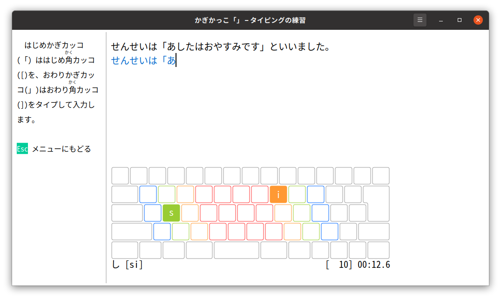
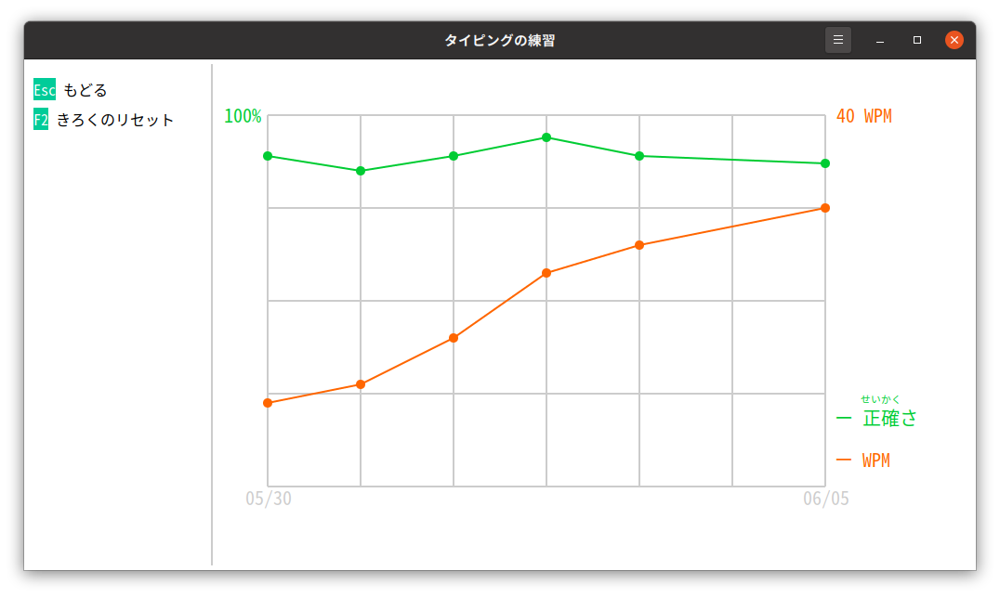

# タイピングの<ruby>練習<rp>(</rp><rt>れんしゅう</rt><rp>)</rp></ruby> (アルファ<ruby>版<rp>(</rp><rt>ばん</rt><rp>)</rp></ruby>)

　「タイピングの<ruby>練習<rp>(</rp><rt>れんしゅう</rt><rp>)</rp></ruby>」は、タイピングの<ruby>練習<rp>(</rp><rt>れんしゅう</rt><rp>)</rp></ruby>ソフトウェアです。「ひらがなIME」で<ruby>設定<rp>(</rp><rt>せってい</rt><rp>)</rp></ruby>したキーボード<ruby>配列<rp>(</rp><rt>はいれつ</rt><rp>)</rp></ruby>をつかって、タイピングを<ruby>練習<rp>(</rp><rt>れんしゅう</rt><rp>)</rp></ruby>できるようになっています。<ruby>将来<rp>(</rp><rt>しょうらい</rt><rp>)</rp></ruby>のバージョンでは、じぶんで<ruby>練習<rp>(</rp><rt>れんしゅう</rt><rp>)</rp></ruby><ruby>教材<rp>(</rp><rt>きょうざい</rt><rp>)</rp></ruby>を<ruby>用意<rp>(</rp><rt>ようい</rt><rp>)</rp></ruby>して<ruby>練習<rp>(</rp><rt>れんしゅう</rt><rp>)</rp></ruby>できるように<ruby>開発<rp>(</rp><rt>かいはつ</rt><rp>)</rp></ruby>をすすめています。

## <ruby>資料<rp>(</rp><rt>しりょう</rt><rp>)</rp></ruby>

　つかいかたについては、「タイピングの<ruby>練習<rp>(</rp><rt>れんしゅう</rt><rp>)</rp></ruby>の<ruby>手<rp>(</rp><rt>て</rt><rp>)</rp></ruby>びき」をみてください。

- [タイピングの<ruby>練習<rp>(</rp><rt>れんしゅう</rt><rp>)</rp></ruby>の<ruby>手<rp>(</rp><rt>て</rt><rp>)</rp></ruby>びき](https://esrille.github.io/typing-practice/)
- [タイピングの<ruby>練習<rp>(</rp><rt>れんしゅう</rt><rp>)</rp></ruby>の<ruby>開発<rp>(</rp><rt>かいはつ</rt><rp>)</rp></ruby>について](https://github.com/esrille/typing-practice/blob/master/CONTRIBUTING.md)
