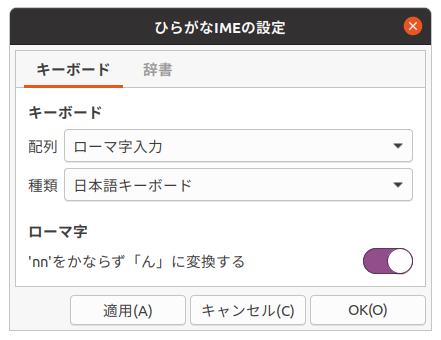
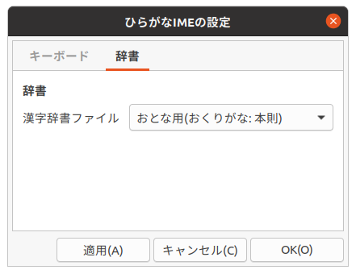
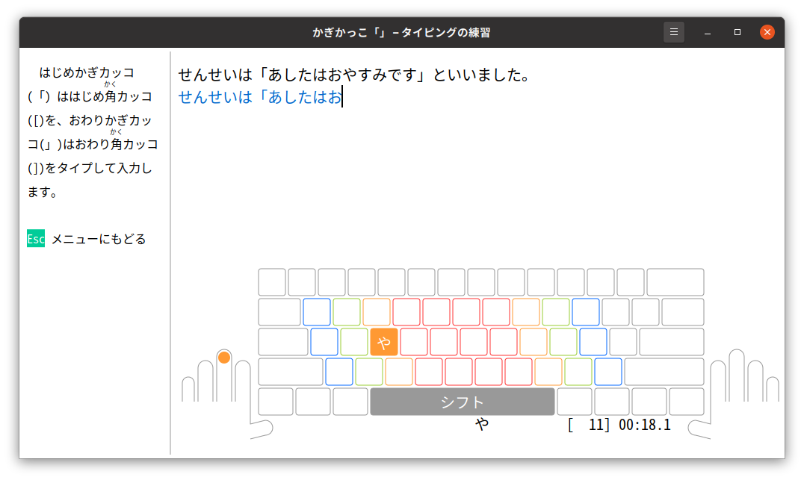

# ひらがなIMEとの連動れんどう

　「タイピングの練習れんしゅう」は、「ひらがなIME」で設定せっていしたキーボード配列はいれつをつかって練習れんしゅうできるようになっています。
　使用しようするキーボード配列はいれつは「ひらがなIMEの設定せってい」で変更へんこうできます。



　漢字かんじのタイピングの練習れんしゅうは、学年がくねんごとにわかれています。「ひらがなIME」の漢字かんじ辞書じしょも練習れんしゅうする学年がくねんにあわせて設定せっていしてください。



## ローマ字じ入力にゅうりょく vs かな入力にゅうりょく

### 日本語にほんごキーボードでローマ字じ入力にゅうりょく


### 英語えいご(US)キーボードでかな入力にゅうりょく（ニュースティックニー配列はいれつ）



　小学生しょうがくせいの段階だんかいでは、１学年がくねんすすむごとに毎まい分ふん25キーくらいおおくうてるようになることをめざしています。

```
   せんせいは「あしたはおやすみです」といいました。
```

　この例文れいぶんは、ローマ字じ入力にゅうりょくだと39回かいキーをおします。かな入力にゅうりょくであれば25回かいほどですみます。
シフトキーをかぞえるか、かぞえないかについては、議論ぎろんがわかれています。
いずれにしても、ローマ字じ入力にゅうりょくで、はやくうてるようになるまで練習れんしゅうするのはたいへんです。
　しかし、現行げんこうのJISジス規格きかくのかな配列はいれつには問題もんだいがおおいのです。
JISも1986年ねんにいちどあたらしいかな配列はいれつを発表はっぴょうしたことがあります。
学校がっこうでもあたらしいかな配列はいれつでおしえることが検討けんとうされました。
けれども、そのときのあたらしいかな配列はいれつが普及ふきゅうすることはありませんでした。
当時とうじはパソコンはひじょうに高価こうかで、じぶんのパソコンをもっている小学生しょうがくせいはほとんどいなかったのです。
　いまは小学生しょうがくせいのときからキーボードを練習れんしゅうするようになりました。
パソコンをとてもやすくつくれるようになったためです。
どんなキーボードの配列はいれつがよいか、みなさんもかんがえてみてください。

