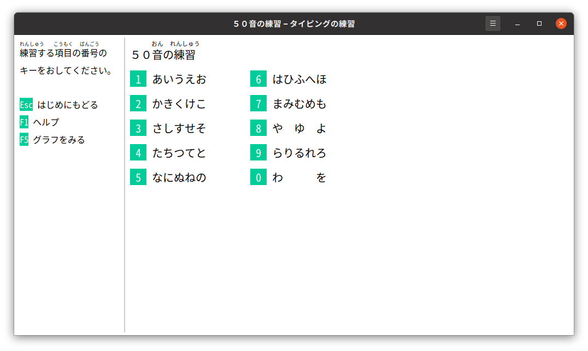

# つかいかた

　「タイピングの練習れんしゅう」をはじめると、したのようなウインドウがひらきます。

　練習れんしゅうをはじめるには、練習れんしゅうしたい項目こうもくの数字すうじをキーボードでおします。
たとえば、数字すうじの[1]をキーボードでおすと、「５０音おんの練習れんしゅう」メニューがひらきます。

　ここでもういちど、数字すうじの[1]をキーボードでおすと、「あいうえお」の練習れんしゅう画面がめんがひらきます。

　この画面がめんで、「あいうえお　あいうえお　あいうえお」と入力にゅうりょくする練習れんしゅうをします。

　画面がめんのしたがわには、キーボードの絵えが表示ひょうじされています。
キーボードの[a]キーをおすと「あ」と入力にゅうりょくできることをあらわしています。
「ひらがなIME」がローマ字じ入力にゅうりょくをつかう設定せっていになっていると、この画面がめんになります。
　キーボードのキーをどの指ゆびでおすかはきまっています。

キーの色いろ | つかう指ゆび
---|---
あお色いろ | 小指こゆび
みどり色いろ | くすり指ゆび
だいだい色いろ | なか指ゆび
あか色いろ | ひとさし指ゆび

スペースバーや[変換へんかん]キーはおや指ゆびでおします。
　じっさいに[a]キーをおすと、画面がめんがつぎのようにかわります。

　つぎは、キーボードの[i]キーをおすと「い」と入力にゅうりょくできることをあらわしています。
タイピングを練習れんしゅうするときは、指ゆびのうごきをおぼえるようにしましょう。
ローマ字じではどうかくのかと、いちいちかんがえたりする必要ひつようはありません。

# まちがえてしまったときは　

　キーをまちがえておしてしまうと、例文れいぶんとちがう文字もじが入力にゅうりょくされてしまうことがあります。
そのときは、キーボードのみぎうえの[Backspaceバックスペース]キーをおして、まちがえた字じをけしてください。
[Backspaceバックスペース]キーには、文字もじのかわりに[⌫]というマークがついていることもあります。

　むやみにキーボードをはやくうとうとすると、キーをまちがえておしてしまいがちです。
タイピングのじょうずなひとがキーをおしまちがえることは、めったにありません。
あせらず、キーをまちがえないように注意ちゅういしながら練習れんしゅうしてみてください。
そのほうが、結果けっか的てきにははやくうてるようになります。

# 練習れんしゅう結果けっか

　テキストをさいごまでただしく入力にゅうりょくできると、練習れんしゅう結果けっかの画面がめんにかわります。
小学生しょうがくせいのあいだは、じぶんの学年がくねんとおなじ数かずの☆ほしをとれるようになるまで練習れんしゅうしてみてください。
たとえば、小学校しょうがっこう５年生ねんせいなら、したの画面がめんのように５つ黄き色いろの☆ほしをとれればじゅうぶんです。

　ぜんぶ入力にゅうりょくするのに、どのくらい時間じかんがかかったか。
どれくらい、まちがえてしまったか。
そうしたことをもとに、☆ほしが表示ひょうじされています。
まちがえておした回数かいすうがおおいと、どんなにはやくキーをうっても☆ほしはふえません。

　練習れんしゅうをさらにつづけるときは[Enterエンター]キーを、メニューにもどるには[Escエスケープ]キーをおします。

# グラフをみる

　タイピングがうまくなっていくスピードは、ひとによってちがいます。
それでも、まいにち練習れんしゅうをつづけていると、だれでもすこしずつはやくうてるようになります。
メニュー画面がめんで[F5]キーをおすと、それまでの練習れんしゅう成果せいかをグラフでたしかめられます。

# 「タイピングの練習れんしゅう」のやめかた

　キーボードで[Ctrl]コントロールキーをおさえながら、[Q]キーをおすと、「タイピングの練習れんしゅう」をやめられます。
　[Ctrl]コントロールキーなどと文字もじキーを同時どうじにおして実行じっこうする操作そうさを「キーボード ショートカット」とよんでいます。
キーボード ショートカットは、よく[Ctrl]-[Q]のようにかかれています。
　基本的きほんてきなコンピューターの操作そうさについては、どのアプリケーション ソフトウェアもおなじキーボード ショートカットをつかうようになっています。
[Ctrl]-[Q]はアプリケーション ソフトウェアを終了しゅうりょうさせるときにつかうキーボード ショートカットです。
[Q]は、英語えいごの"quit"という単語たんごの頭かしら文字もじからきています。「やめる」という意味いみです。

